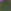
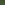

# Process-Light-Fields-Captured-with-Lytro-Camera-via-Light-Field-Toolbox-for-MATLAB
This repository contains the source code and materials for processing light fields captured with a First Generation Lytro Camera, the [Light Field Toolbox for MATLAB](https://dgd.vision/Tools/LFToolbox/) (*with [license](LFToolbox0.5/LICENSE.txt) [1]*) is implemented in order to obtain the sub-aperture images, the angular matrix at some fixed spatial point or all spatial points.

Moreover, this repository only contains two captured light fields as examples, the full dataset is avalible at [asdasd](asdasd) [2].

***Authors: Juan Felipe Jaramillo Hernández, María Fernanda Hernández Baena***

Contents Table
=================

<!--ts-->
   * [Process Light Fields Captured with Lytro Camera via Light Field Toolbox for MATLAB](#Process-Light-Fields-Captured-with-Lytro-Camera-via-Light-Field-Toolbox-for-MATLAB)
   * [Contents Table](#Contents-Table)
   * [Light Field Toolbox For MATLAB](#Light-Field-Toolbox-For-MATLAB)
   * [Calibration Data](#Calibration-Data)
   * [Sub-aperture Images Extraction](#Sub-aperture-Images-Extraction)
   * [Other Processing Options](#Other-Processing-Options)
      * [Angular Portion Extraction](#Angular-Portion-Extraction)
      * [Spatial Downsampling](#Spatial-Downsampling)
      * [Video Maker](#Video-Maker)
   * [References](#References)
      * 
<!--te-->

## Light Field Toolbox For MATLAB
The material in this repository wouldn't be possible without the [Light Field Toolbox for MATLAB](https://dgd.vision/Tools/LFToolbox/) [1], who may concern, who may concern,  my deepest thanks for making possible the processing of light fields.

First of all, you need to donwload the zipped [Light Field Toolbox for MATLAB](https://dgd.vision/Tools/LFToolbox/) [1]. Once donwloaded, please unzip the content in its corresponding [path](LFToolbox0.5) in order to use the algorithims implemented in this repository.

## Calibration Data
In order to obtain the calibration data from you camera, it is required some previous steps:

The first one, is to locate the calibration files from you Lytro camera, this files are called *data.C.0, data.C.1, data.C.2, data.C.3* and are usually located at *AppData/Local/Lytro/cameras*. Since each file is around 300 MB, these files are not contained in this repository. You'll extract white image calibration data from those. Once you found these files, place them at [Camera's folder](Cameras/sn-A102430881/).

The second step is to obtain the camera's matrix and distortion parameters in order to successfully rectify the captured light fields. For this, you have to capture some calibration light fields of some checkerboard, the more corners and smallest squares, the better results. This repository contains 9 [calibration light fields](Cameras/sn-A102430881/CalSamples) captured on a checkerboard with 19x22 cornes and 4mm square size. Save calibration light fields at Cameras/sn-A102430881/CalSamples if you want to use your own samples.

Once your camera calibration data and your calibration light fields are on place, you'll just need to run [calibration.m](calibration.m) to adquire the calibration data. This program will automatically save the next files in their corresponding paths: [CallInfo.json](Cameras/sn-A102430881/CalSamples/CalInfo.json), [CalibrationDatabase.mat](Cameras/CalibrationDatabase.mat) for rectify purposes and [WhiteImageDatabase.mat](Cameras/WhiteImageDatabase.mat) for decoding and color correction on the light fields. Before extracting the previous files, you have to specify via GUI the [Light Field Toolbox path](LFToolbox0.5). This repository contains both rectify and decoding calibration data already extracted, so feel free to use them as well.

**Calibration Light Field Thumb**

**Calibration Light Field Rectified Thumb**

## Sub-aperture Images Extraction
Once calibration data is available, you can proceed to process your own captured light fields. Place these light fields at the [LF folder](LF/). Then, you just have to run [spatial_extraction.m](spatial_extraction.m). 

This program will ask you first to select the [Light Field Toolbox path](LFToolbox0.5), then, it will ask you to select the [LF folder path](LF/), finally, it will ask you to select the [CallInfo.json file's path](Cameras/sn-A102430881/CalSamples/CalInfo.json).

Therefore, the program will decodify each .lfp file at [LF folder](LF/), correcting the color on it and rectifying the scene. Then, it will extract a [mosaic](LF/Mosaicos/) image and the [sub-aperture images](LF/Frames) as well.

**Light Field Central View Thumb (Color corrected and rectified)**

**Mosaic Image**

**Sub-aperture Images as Sequence of Images**

## Other Processing Options

### Angular Portion Extraction

Also, some part of the code will extract an [angular portion](LF/Angular) of 9x9 pixels (since 9x9 is the angular resolution of Lytro First Generation) and a downsampled angular portions of 5x5 pixels for different fixed spatial points. Feel free to use it or modify it as well.

**Angular Portion at (0, 0) spatial coordinate**

**Downsampled Angular Portion at (0, 0) spatial coordinate**

### Spatial Downsampling
[downscaling.m](downscaling.m) is a code with the purpose to downsample the sub-aperture images of each light field. It has nothing special on it.

### Video Maker
[video_maker.py](video_maker.py) is a code to convert the sub-aperture images sequences into a video format, just for practical visualization of each light field as a sequence of images.

## References
[1] Light Field Toolbox for Matlab, available at https://dgd.vision/Tools/LFToolbox/
[2] our lightfield dataset link