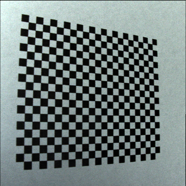
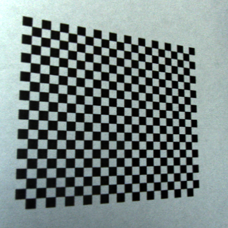
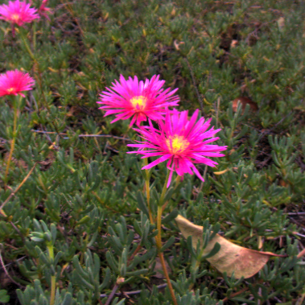
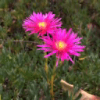
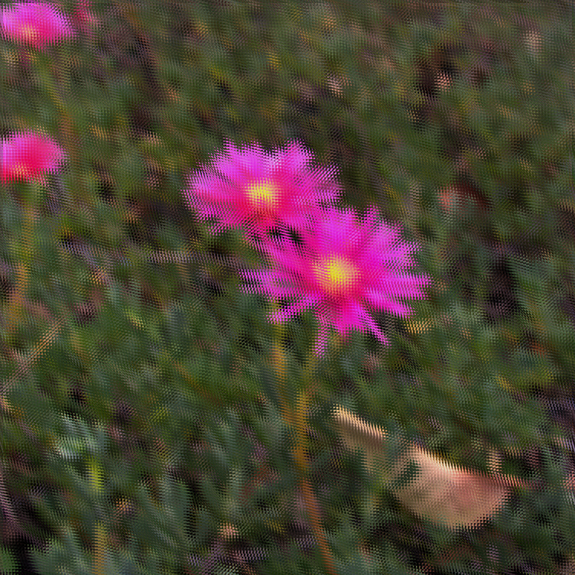

# Process-Light-Fields-Captured-with-Lytro-Camera
This repository contains the source code and materials for processing light fields captured with a First Generation Lytro Camera, the [Light Field Toolbox for MATLAB](https://dgd.vision/Tools/LFToolbox/) (*with [license](LFToolbox0.5/LICENSE.txt) [1]*) is implemented in order to [decode, color correct and rectify](calibration.m) each light field in preparation to [obtain the sub-aperture images](subimgs_extraction.m). Also, an [angular spatial light field downsampling](angular_spatial_downsampling.py) code is implemented.

Moreover, this repository only contains two captured light fields as examples, the full dataset is avalible at [asdasd](asdasd) [2].

***Authors: Juan Felipe Jaramillo Hernández, María Fernanda Hernández Baena***

Table of Contents
=================

<!--ts-->
   * [Process Light Fields Captured with Lytro Camera](#Process-Light-Fields-Captured-with-Lytro-Camera)
   * [Table of Contents](#Table-of-Contents)
   * [Light Field Toolbox For MATLAB](#Light-Field-Toolbox-For-MATLAB)
   * [Calibration Data](#Calibration-Data)
   * [Sub-aperture Images Extraction](#Sub-aperture-Images-Extraction)
   * [Angular and Spatial Downsampling](#Angular-and-Spatial-Downsampling)
   * [Other Minor Processing Options](#Other-Processing-Options)
      * [Video Maker](#Video-Maker)
   * [References](#References)
      * 
<!--te-->

## Light Field Toolbox For MATLAB
The material in this repository wouldn't be possible without the [Light Field Toolbox for MATLAB](https://dgd.vision/Tools/LFToolbox/) [1], who may concern, our deepest thanks for making possible and available this processing pipeline for light fields.

First of all, you need to donwload the zipped [Light Field Toolbox for MATLAB](https://dgd.vision/Tools/LFToolbox/) [1]. Once donwloaded, please unzip the content in its corresponding [path](LFToolbox0.5) in order to use the algorithims implemented in this repository.

## Calibration Data
In order to obtain the calibration data from you camera, it is required some previous steps:

* First, you have to locate the calibration files from you Lytro camera, this files are called *data.C.0, data.C.1, data.C.2, data.C.3* and are usually located at *AppData/Local/Lytro/cameras*. Since each file is around 300 MB, these files are not contained in this repository. You'll extract white image calibration data from those. Once you found these files, place them inside this location: [Cameras/sn-A102430881/](Cameras/sn-A102430881/).

* Second, you have to capture some calibration light fields of some checkerboard, the more corners and smallest squares, the better results. This repository contains 9 [calibration light fields](Cameras/sn-A102430881/CalSamples) captured on a checkerboard with 19x22 cornes and 4mm square size. If you want to use your own samples, save them inside of [Cameras/sn-A102430881/CalSamples](Cameras/sn-A102430881/CalSamples).

Once your camera calibration data and your calibration light fields are on place, you'll just need to run [calibration.m](calibration.m) to adquire the calibration data; camera matrix and distortion parameters, white image calibration grids and others. Before processing the previous files, you have to specify via GUI the Light Field Toolbox path, beign [LFToolbox0.5/](LFToolbox0.5/) in this repository.

The program will automatically save the next files in their corresponding paths: CallInfo.json (at [Cameras/sn-A102430881/CalSamples/](Cameras/sn-A102430881/CalSamples/CallInfo.json)), CalibrationDatabase.mat (at [Cameras/](Cameras/CalibrationDatabase.mat)) for rectify purposes and WhiteImageDatabase.mat (at [Cameras/](Cameras/WhiteImageDatabase.mat)) for decoding and color correction purposes. This repository contains both [rectify](Cameras/sn-A102430881/CalSamples/CallInfo.json) and [decoding](Cameras/WhiteImageDatabase.mat) calibration data already extracted, so feel free to use them as well.

**Calibration Light Field Thumb**

**Calibration Light Field Rectified Thumb**

## Sub-aperture Images Extraction

Once calibration data is available, you can proceed to process your own captured light fields. Place these light fields at the LF folder [LF/](LF/). Then, you just have to run [subimgs_extraction.m](subimgs_extraction.m). This program will ask you first to select the Light Field Toolbox path ([LFToolbox0.5/](LFToolbox0.5) in this repository), then, it will ask you to select the LF folder path [LF/](LF/), and finally, it will ask you to select the [CallInfo.json file's path](Cameras/sn-A102430881/CalSamples/CalInfo.json).

Therefore, the program will decodify each .lfp file placed in the LF folder, correcting the color on it and rectifying the scene. Then, it will extract a mosaic image, saving it at [LF/Mosaicos/](LF/Mosaicos/), and then, it will extract the sub-aperture images, saving it at [LF/Frames](LF/Frames) as well.

**Light Field Central View Thumb (Color corrected and rectified)**

**Mosaic Image**

**Sub-aperture Images as Sequence of Images**

### Angular and Spatial Downsampling

[angular_spatial_downsampling.py](angular_spatial_downsampling.py) will angular and spatial downsample all original sub-aperture images inside the directory [LF/Frames](LF/Frames), extracted from before. The program will save the results inside the same directory but creating new sub-folders, corresponding to the sub-aperture images spatial downsampled (example: [LF/Frames/IMG_0001_sdownsampled](LF/Frames/IMG_0001_sdownsampled)) and angular spatial downsampled (example: [LF/Frames/IMG_0001_asdownsampled](LF/Frames/IMG_0001_asdownsampled)). 

**Spatial Downsampled Sub-aperture Images as Sequence of Images**

**Angular-Spatial Downsampled Sub-aperture Images as Sequence of Images**

Also, it will synthesize the complete original light field structure arranged by its angular resolution at each spatial point, and its equivalent but angular and spatial downsampled.

**Light Field Structure *stuv***

**Angular-Spatial Downsampled Light Field Structure *stuv***

Moreover, this code process the sub-aperture images of each light field by spatial downsampling it by some given factor, therefore, angular downsampling it by some factor given by the original angular resolution and the desired downsampled angular resolution. Since we're implementing an antialising frequency filter for each downsampling process, this code will take serious time processing each light field.

## Other Minor Processing Options

### Video Maker
[video_maker.py](video_maker.py) is a code to convert the sub-aperture images sequences into a video format, just for practical visualization of each light field as a sequence of images. This code will take every folder inside [LF/Frames](LF/Frames) in order to generate and save a corresponding video at [LF/Videos](LF/Videos).

## References

[1] Light Field Toolbox for Matlab, available at https://dgd.vision/Tools/LFToolbox/

[2] our lightfield dataset link